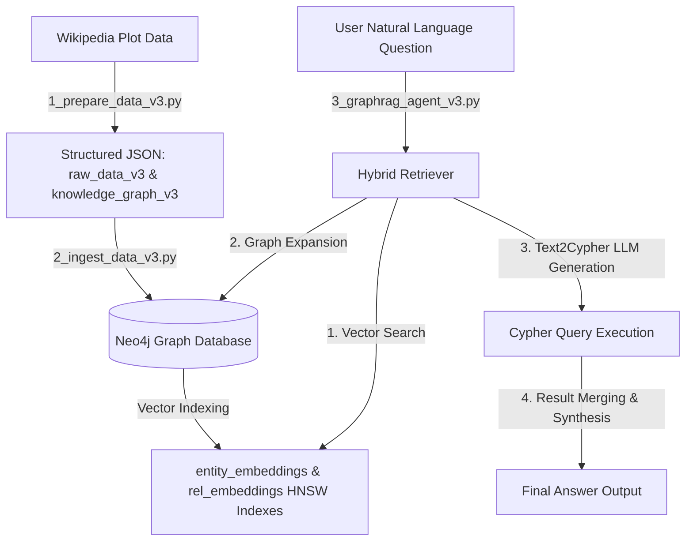

# PRD: GraphRAG Agent (Demon Slayer Season 1 Knowledge Graph) 🕸️

## 1. Document & Project Overview

- **Project Name:** `learn_graphrags_agent`
- **Target Domain:** Knowledge Graph Construction and Natural Language QA for Anime Plot Summaries (Demon Slayer Season 1)
- **Primary Goal:** Transform unstructured plot text into a structured Neo4j Knowledge Graph and deliver high-precision Hybrid Retrieval (Vector Similarity + Graph Expansion + Text2Cypher) for natural language questions.

---

## 2. Project Architecture & Technical Stack

### Technical Stack

| Component | Technology | Purpose |
| :--- | :--- | :--- |
| **Language & Runtime** | Python 3.12+ / `uv` | Strictly typed runtime execution |
| **Graph Database** | Neo4j 5+ (Docker Container) | Knowledge Graph storage & Cypher query execution |
| **LLM Provider** | Ollama (`sam860/exaone-4.0:1.2b-thinking-Q8_0`) / OpenAI API | Entity/Relationship extraction, Text2Cypher, Answer synthesis |
| **Embedding Engine** | Ollama (`bge-m3:567m` - 1024 dim) / OpenAI | Node & Relationship vector embedding generation |
| **Orchestration** | LangChain / LangGraph / Neo4j-GraphRAG | Agent state graph & hybrid retrieval pipeline |
| **Web Scraping** | BeautifulSoup4 & Requests | Wikipedia plot summary scraping |
| **Data Validation** | Pydantic v2 | JSON schema validation and entity sanitization |
| **Configuration** | `python-dotenv` & `config.py` | Centralized `.env` environment loading |

### High-Level Architecture



---

## 3. Current Project Analysis (현재 프로젝트 분석)

### 3.1 Pipeline Execution Analysis

1. **Step 1: Data Preparation (`src/v3/1_prepare_data_v3.py`)**
   - Scrapes Wikipedia Demon Slayer Season 1 episode summaries.
   - Calls LLM with structured Pydantic schemas (`Node`, `Relationship`, `GraphResponse`).
   - Normalizes canonical Korean names (e.g. `카마도 탄지로`, `토미오카 기유`, `키부츠지 무잔`).
   - Validates node labels (`인간`, `도깨비`) and relationship types (`FIGHTS`, `PROTECTS`, `TRAINS`, etc.).
   - Outputs `output/raw_data_v3.json`, `output/knowledge_graph_v3.json`, and `output/statistics_v3.json`.

2. **Step 2: Data Ingestion (`src/v3/2_ingest_data_v3.py`)**
   - Clears existing Neo4j database to guarantee idempotency.
   - Generates 1024-dimensional embeddings for all nodes and relationships using `bge-m3:567m`.
   - Creates nodes with property `embedding` and relationships with property `embedding`.
   - Automatically builds HNSW vector indexes: `entity_embeddings_*` and `rel_embeddings_*`.

3. **Step 3: GraphRAG Agent (`src/v3/3_graphrag_agent_v3.py`)**
   - **Query Classifier**: Categorizes queries into `SINGLE_ENTITY`, `RELATIONSHIP`, `EPISODE_SPECIFIC`, or `GENERAL`.
   - **Vector Retriever**: Computes cosine similarity to pull seed nodes and relevant relationships.
   - **Graph Expander**: Performs 1~2 hop graph traversals from seed nodes.
   - **Clean LLM Parser**: Post-processes responses from thinking models by stripping `<think>...</think>` tags.
   - **Cypher Generator & Executor**: Generates safe, parameterized Cypher queries with retry loops and schema context.

---

## 4. Configuration & Environment Management (.env)

All application configurations are managed centrally via `.env` (root directory or `dockers/.env`) and accessed cleanly through `config.py`.

### `.env` Variable Specification

```env
# Infrastructure & Containers
PROJECT_NAME=graphrag_agent
COMPOSE_PROFILES=neo4j,postgres,mongo,ollama,app

# Neo4j Database
NEO4J_URI=bolt://localhost:7687
NEO4J_USER=neo4j
NEO4J_PASSWORD=admin123
NEO4J_DATABASE=db-graphrag-agent

# LLM & Embedding Server
LLM_MODEL=sam860/exaone-4.0:1.2b-thinking-Q8_0
EMBEDDING_MODEL=bge-m3:567m
MODEL_API_URL=http://localhost:11434/v1
OPENAI_API_KEY=ollama

# Hybrid Retrieval Settings
USE_HYBRID_RETRIEVAL=true
VECTOR_TOP_K=5
GRAPH_EXPANSION_DEPTH=2

# Vector Indexes & Schema
VECTOR_INDEX_NODE=entity_embeddings
VECTOR_INDEX_RELATIONSHIP_PREFIX=rel_embeddings
EMBEDDING_DIMENSION=1024
NODE_LABELS=인간,도깨비
RELATIONSHIP_TYPES=FIGHTS,PROTECTS,TRAINS,TRAINS_WITH,KNOWS,FAMILY_OF,SIBLING_OF,ALLY_OF,ENEMY_OF,DEFEATS,SAVES,RESCUES,MEETS,ENCOUNTERS,GUIDES,ATTACKS,DEFENDS,TRANSFORMS,JOINS,SUPPORTS,REUNITES_WITH,BATTLES,HEALS,TEACHES
```

---

## 5. Version-Based Directory Structure

Executable scripts are organized into versioned folders under `src/`:

```text
/apps/learn_graphrags_agent
├── .env                              # Root Environment Variables
├── config.py                         # Centralized Config Loader
├── PRD.md                            # Product Requirements Document
├── README.md                         # Project Readme & Instructions
├── dockers/                          # Docker Services Setup
│   ├── .env
│   ├── docker-compose.yml
│   ├── Dockerfile.ollama
│   └── Dockerfile.fullstack
├── output/                           # Output Data Artifacts
├── docs/                             # Documentation
│   └── agent/
│       └── harness_prompt.md         # Agent Harness Prompt Specification
└── src/                              # Source Code by Version
    ├── v1/                           # Baseline Version (Basic Text2Cypher)
    │   ├── 1_prepare_data_v1.py
    │   ├── 2_ingest_data_v1.py
    │   └── 3_graphrag_agent_v1.py
    ├── v2/                           # Intermediate Version (Metadata Filtered Vector RAG)
    │   ├── 1_prepare_data_v2.py
    │   ├── 2_ingest_data_v2.py
    │   └── 3_graphrag_agent_v2.py
    ├── v3/                           # Production Hybrid Version (Vector + Graph Expansion + Text2Cypher)
    │   ├── 1_prepare_data_v3.py
    │   ├── 2_ingest_data_v3.py
    │   └── 3_graphrag_agent_v3.py
    └── utils/                        # Utilities
        └── check_indexes.py
```

---

## 6. Execution & Verification Guide

### 1. Environment & Docker Startup

```bash
# Start Docker containers (Neo4j, Ollama, etc.)
cd dockers
docker-compose up -d
cd ..
```

### 2. Execution Commands (Version 3 Recommended)

```bash
# Step 1: Wikipedia Scraping & Graph Extraction
uv run src/v3/1_prepare_data_v3.py

# Step 2: Ingest Graph Data into Neo4j & Build Vector Indexes
uv run src/v3/2_ingest_data_v3.py

# Step 3: Run Interactive GraphRAG Agent
uv run src/v3/3_graphrag_agent_v3.py

# Utility: Check Neo4j Vector Indexes
uv run src/utils/check_indexes.py
```
