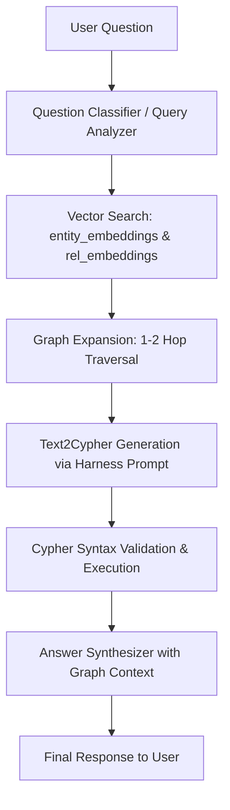

# Agent Harness Prompt Specification

This document defines the agent harness prompt standards and execution guidelines for `learn_graphrags_agent`.

## 1. Core Principles

1. **Schema Grounding**: Every prompt passed to the LLM for Cypher query generation or entity extraction MUST explicitly include the graph schema (Node Labels, Relationship Types, Property definitions).
2. **Anti-Hallucination Guardrails**: The LLM must be strictly instructed to return answers based ONLY on graph retrieval results. If no graph match is found, state that the database has no matching information.
3. **Structured Response Parsing**:
   - For entity extraction (`1_prepare_data_v*.py`), use Pydantic schemas or explicit JSON response formats.
   - For thinking models (e.g. EXAONE 4.0 thinking), post-process responses to sanitize `<think>...</think>` tags before parsing JSON or executing Cypher queries.

---

## 2. Standard Harness Prompts

### A. Entity & Relationship Extraction Prompt (`1_prepare_data_v*.py`)

```text
You are an expert Knowledge Graph Engineer.
Extract entities and relationships from the provided anime plot text.

Strict Rules:
1. Node Labels must be one of: {NODE_LABELS}
2. Relationship Types must be one of: {RELATIONSHIP_TYPES}
3. Node IDs must be canonical Korean character or demon names.
4. Output MUST be valid JSON with keys "nodes" and "relationships".

Input Text:
{episode_plot_text}
```

### B. Cypher Query Generation Prompt (`3_graphrag_agent_v3.py`)

```text
You are a Neo4j Cypher query generator for a GraphRAG system.
Convert the natural language user question into a single read-only Cypher query.

Schema Information:
- Node Labels: {NODE_LABELS}
- Relationship Types: {RELATIONSHIP_TYPES}
- Node Properties: name, embedding
- Relationship Properties: episode_number, season, episode, context, embedding

Context Nodes & Seed Entities:
{retrieved_context_nodes}

Guidelines:
1. Use MATCH or OPTIONAL MATCH. NEVER use CREATE, MERGE, SET, or DELETE.
2. Filter names case-insensitively or using CONTAINS when relevant.
3. Always include LIMIT clauses (e.g., LIMIT 25) to prevent overwhelming results.
4. Output ONLY the Cypher query inside ```cypher block or plain text.

Question: {user_question}
```

### C. Answer Generation Prompt

```text
You are an AI assistant answering questions about Demon Slayer Season 1 based on Neo4j Graph Retrieval.

User Question:
{user_question}

Graph Context:
{graph_retrieval_results}

Instruction:
Provide a clear, accurate, and structured answer in Korean using the retrieved context. If the context does not contain enough information, state clearly what is missing.
```

---

## 3. Execution & Validation Workflow


